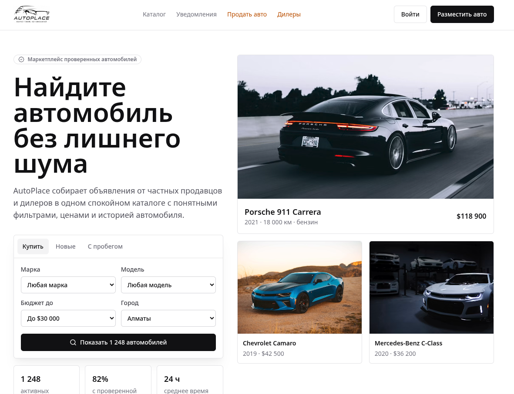
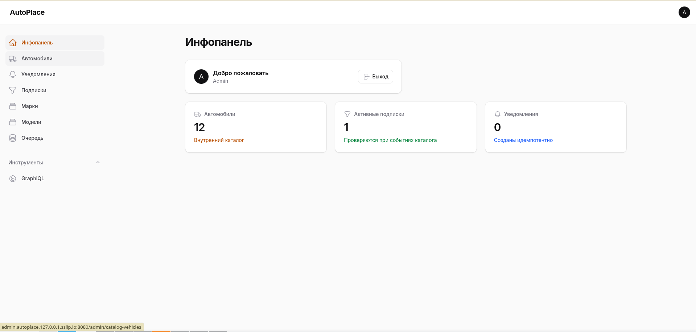

# AutoPlace

- Проект был выполнен в рамках тестового задания на позицию Senoir Php Developer.
- В проекте реализован 2 пункт из [технического задания](docs/take_home_assignments.md)


Пользователь выбирает фильтр на сайте, создаёт подписку, а когда во внутреннем каталоге появляется подходящая машина, система создаёт уведомление.

## Скриншоты

Клиентская часть:



Админка:



## Запуск

```bash
docker compose up --build
```

## Тесты

```bash
php artisan test
```

## Гайд

[Стартовая страница](http://autoplace.127.0.0.1.sslip.io:8080)

#### Админка:
- Логин: `admin@example.com`
- Пароль: `password`

#### База:
- Host: `127.0.0.1`
- Port: `5433`
- Database: `cars`
- User: `cars`
- Password: `secret`

Создать демо-машины:

```bash
php artisan demo:add-catalog-vehicle --count=25
```

или `Админка -> Автомобили -> Сгенерировать`.


## Стек

Бэк: Laravel, Filament, Lighthouse GraphQL, PostgreSQL.

Фронт: React, TypeScript, Inertia.js, shadcn/ui.

Инфра: Docker Compose, Caddy, queue worker, scheduler, Vite, Homepage, Dozzle.
